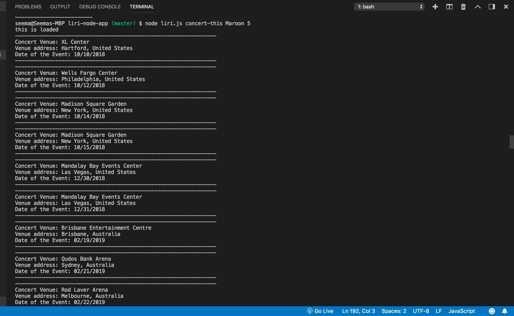
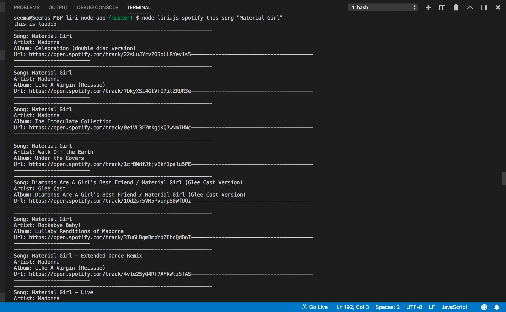
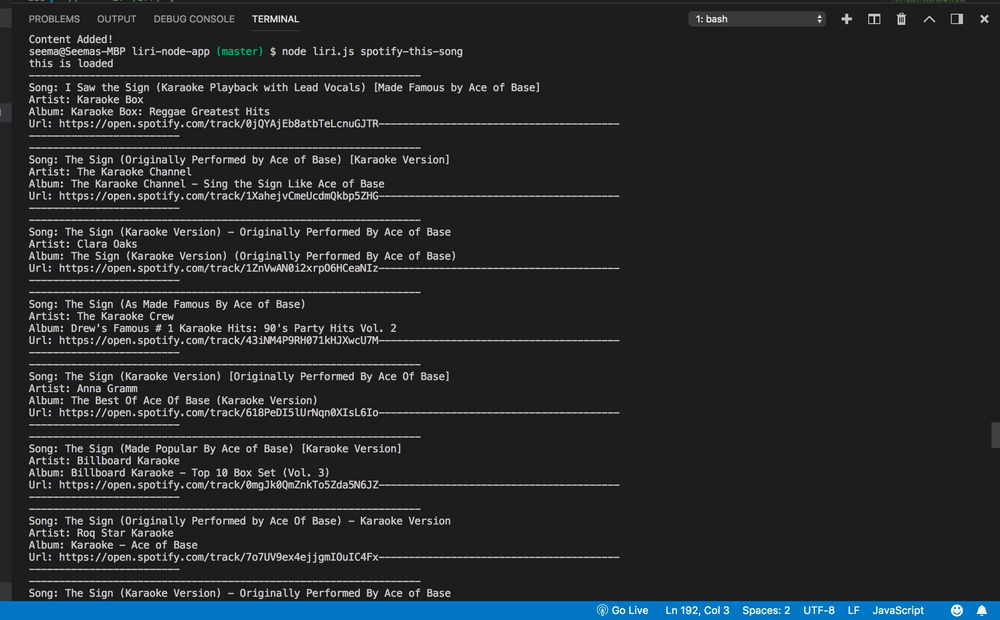
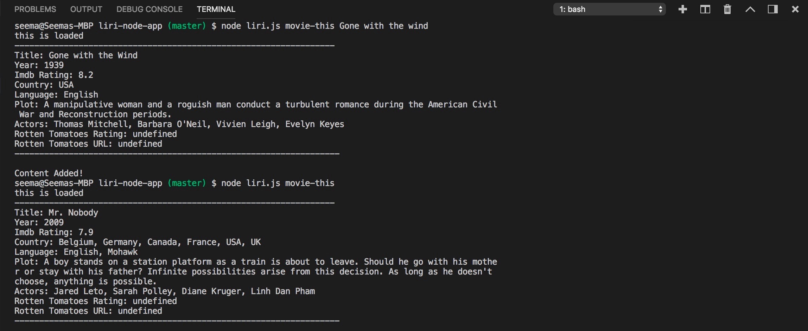
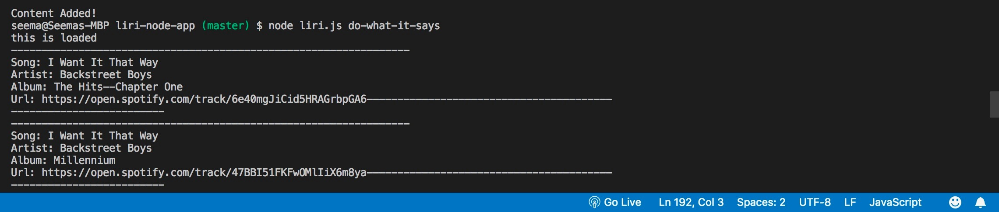

# liri-node-app
Language Interpretation &amp; Recognition Interface
# LIRI Bot

### Overview

In this assignment, I created LIRI: _Language_ Interpretation and Recognition Interface. LIRI is a command line node app that takes in parameters and gives  back data.


1. LIRI will search Spotify for songs, Bands in Town for concerts, and OMDB for movies.

3. To retrieve the data that will power this app, I needed to send requests to the Bands in Town, Spotify and OMDB APIs. The following Node packages were required for this assignment.

   * [Node-Spotify-API](https://www.npmjs.com/package/node-spotify-api)

   * [Request](https://www.npmjs.com/package/request)

     * I used Request to grab data from the [OMDB API](http://www.omdbapi.com) and the [Bands In Town API](http://www.artists.bandsintown.com/bandsintown-api)

   * [Moment](https://www.npmjs.com/package/moment)

   * [DotEnv](https://www.npmjs.com/package/dotenv)
   
liri can take in one of the following commands:

   * `concert-this`

   * `spotify-this-song`

   * `movie-this`

   * `do-what-it-says`

### What Each Command Does

1. `node liri.js concert-this <artist/band name here>`

   * This searches the Bands in Town Artist Events API (`"https://rest.bandsintown.com/artists/" + artist + "/events?app_id=codingbootcamp"`) for an artist and renders the following information about each event to the terminal:

     * Name of the venue

     * Venue location

     * Date of the Event (I used moment to format this as "MM/DD/YYYY")

     * It also writes to the log.txt file

 Here is an Example:   

   

2. `node liri.js spotify-this-song '<song name here>'`

   * This shows the following information about the song in terminal/bash window

     * Artist(s)

     * The song's name

     * A preview link of the song from Spotify

     * The album that the song is from


 Here is an Example:

   


   * If no song is provided then the program defaults to "The Sign" by Ace of Base.

   * It utilizes the [node-spotify-api](https://www.npmjs.com/package/node-spotify-api) package in order to retrieve song information from the Spotify API.

   * The Spotify API requires credentials. 

* In both cases the output is also writtten to the log.txt file.

Here is an Example: 

 

  

3. `node liri.js movie-this '<movie name here>'`

   * This utilizes the [OMDB API](http://www.omdbapi.com) and will output the following information to terminal/bash window:

     ```
       * Title of the movie.
       * Year the movie came out.
       * IMDB Rating of the movie.
       * Rotten Tomatoes Rating of the movie.
       * Country where the movie was produced.
       * Language of the movie.
       * Plot of the movie.
       * Actors in the movie.
     ```

   * If the user doesn't type in a movie, the program will output data for the movie 'Mr. Nobody.'

Here are Examples:

 


4. `node liri.js do-what-it-says`

   * Using the `fs` Node package, LIRI takes the text inside of random.txt and then uses it to call one of LIRI's commands.

     * It runs `spotify-this-song` for "I Want it That Way," 

Here is an Example:

 

* In addition to logging the data to the terminal/bash window, it also adds it to `log.txt`.

5. These are the npm pakages I used to run the app:

    * fs 
    * request
    * spotify
    * moment
    * spotify
    * DotEnv
